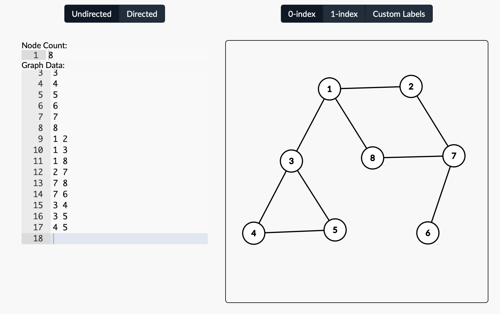

# DFS / BFS
> DFS / BFS is a searching algorithm using stack, queue, or by recursion.    
> They both search a graph of `Node` and `Edges` but in a different manner. 

The difference between DFS and BFS are : 
- DFS(Depth-First_Search) - searches **Deepest** Node first. 
- BFS(Breath First Serch) - searches **Closest** Node first. 

DFS can use `Recursion` to solve its problems, 
but it normally takes longer time than using `Stack` 
to implement.  

To give an example: 

If there is a graph like the one above, and it starts from `Node #1`, 
and it searches to the adjacent `Node` that is smaller in number. 
This will be the way how DFS and BFS will search. 
- DFS : 1 → 2 → 7 → 6 → 8 → 3 → 4 → 5
- BFS : 1 → 2 → 3 → 8 → 7 → 4 → 5 → 6

_Source code of two example is provided._ 